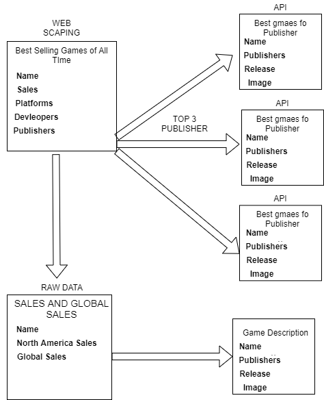

## Data Management and Database Design Gathering, Scraping, Munging and Cleaning Data
### Assignment 1
#### Group Name: Shaktiman

#### Group Member 1: Suman Rawat (NUID 001058600) Group Member 2: Shakti Chetan (NUID 001375816)

In this assignment, we will be gathering real-world data of the video games. This process is often called data munging or data wrangling. All our database tables are populated with real-world websites and web APIs. Objective of this assignment is to learn the data gathering, scraping and cleaning up the data for further analysis purpose.

We are using three sources:

> Web scraping

> Web API

> Raw csv file data

Web Scraping: we have scraped the bestselling video games data from the Wikipedia website using BeautifulSoup library of the python. Later we have performed the data cleaning on the extracted dataset to remove the NA, null or any other unwanted data values. After performing data cleaning entire data set is converted into the Pandas dataframe to find the best publishers of the video games. Best publishers are those who have published the greatest number of bestselling video games.

Web API: For this assignment we are using the API wrapper to extract the API data. An API wrapper is code that you install on your system to make the APIs easier to use in your chosen programming language. We have achieved this with rawg, rawgpy and requests libraries of the python.

Raw csv data file: Extracting the raw csv data file for the video games sales data. This file includes all sales related data for different regions of US and Europe. Sales of the games are present in a yearly based fashion. To validate the scraped data, we will provide a list of best-selling video list to the csv file extracted data frame, this will give us the global and north America sale of the bestselling video games.

Histogram for Best-selling games against their north America sales.

## Conceptual Schema of the Database

## Contribution Statement

* Conception or design of the work – Shakti and Suman
* Data collection for Web scraping: Suman
* Data collection for web API and raw csv file: Shakti Chetan
* Drafting the article: Suman
* Creating Conceptual Schema: Shakti Chetan
* Critical revision of the article: Suman and Shakti
